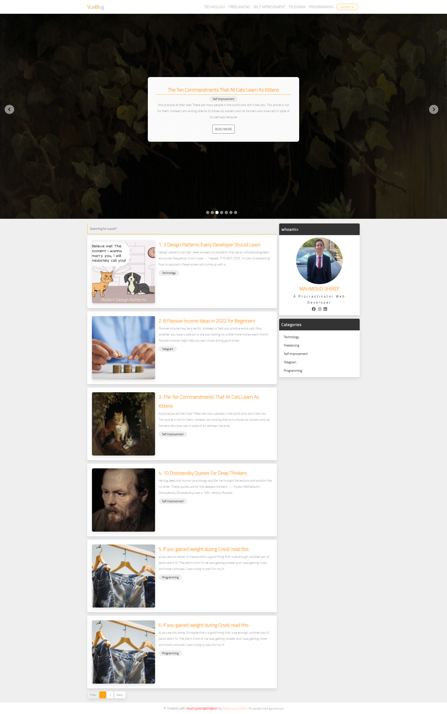

# SINGLE PAGE BLOG BY VUE3

Backend simulation by json-server

## Project setup

```
npm install
```

### Run json server to simulate backend api

```
json-server --watch backend/db.json
```

### Compiles and hot-reloads for development

```
npm run serve
```

### Compiles and minifies for production

```
npm run build
```

## Preview


